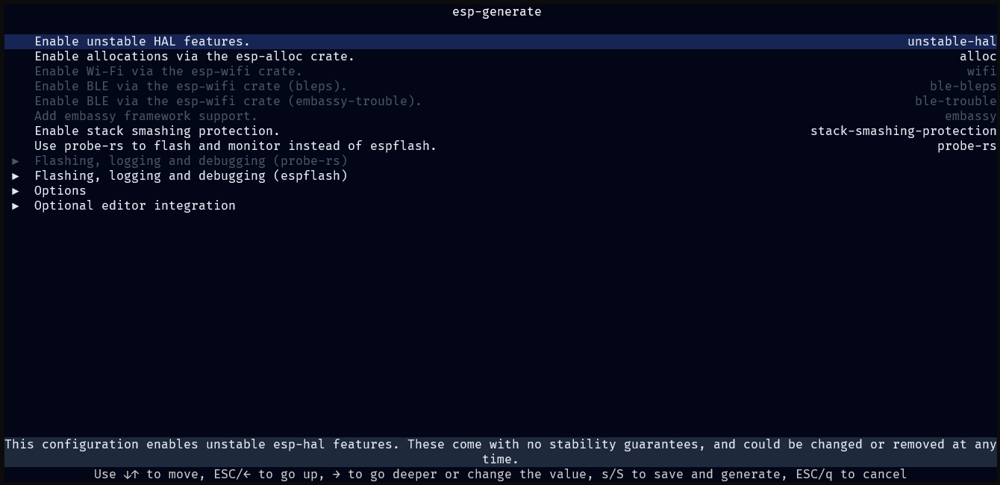

# FreeRTOS ArielOS Benchmark

## Instalação e uso das ferramentas

  
Ariel OS

   
  
  Pré-requisitos:
  - [rustup](https://rustup.rs/)

  Com o rustup instalado, abra um terminal e execute os seguintes comandos para instalação das bibliotecas necessárias:
  1. `cargo install espup --locked`
  2. `espup install`
  3. Caso use Linux, deverão ser configuradas as variáveis de ambiente, mais informações em [`espup README`](https://github.com/esp-rs/espup?tab=readme-ov-file#environment-variables-setup)
  4. `cargo install esp-generate --locked`
  5. `cargo install espflash --locked`
  6. `cargo install probe-rs-tools --locked`
  7. `cargo install esp-config --features=tui --locked`

  ## Utilizando as ferramentas

  ### Geração de um novo projeto
  Para gerar um novo projeto, abra um terminal no local onde deseja que o projeto seja criado e execute `esp-generate`.
  
  Uma tela será apresentada, na qual você deve configurar a versão utilizada da ESP32 (no nosso caso, será a ESP32-WROOM-32D)

  

   

  ### Executando um projeto
  Para executar um projeto, abra um terminal no local onde o projeto foi criado e execute `cargo run --release`.

  
FreeRTOS

