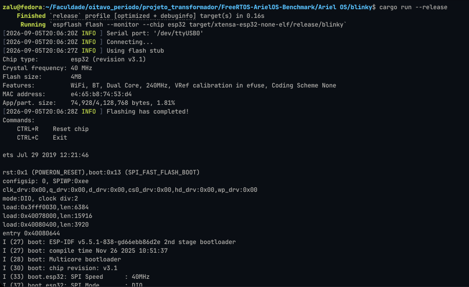

# FreeRTOS ArielOS Benchmark

## Instalação e uso das ferramentas

<details>
  <summary>Ariel OS</summary>

  <br>

  ### Pré-requisitos

  - [rustup](https://rustup.rs/)

  ### Instalação

  Com o `rustup` instalado, abra um terminal e execute os seguintes comandos para instalação das ferramentas necessárias:

  ```bash
  cargo install espup --locked
  espup install
  ```

  Caso utilize Linux, deverão ser configuradas as variáveis de ambiente. Mais informações podem ser encontradas no [`espup README`](https://github.com/esp-rs/espup?tab=readme-ov-file#environment-variables-setup).

  Em seguida, instale as demais ferramentas:

  ```bash
  cargo install esp-generate --locked
  cargo install espflash --locked
  cargo install probe-rs-tools --locked
  cargo install esp-config --features=tui --locked
  ```

  ## Utilizando as ferramentas

  ### Geração de um novo projeto

  Para gerar um novo projeto, abra um terminal no diretório onde deseja que o projeto seja criado e execute:

  ```bash
  esp-generate
  ```

  Uma interface será apresentada para configuração do microcontrolador utilizado no projeto.

  Neste trabalho, será utilizado o **ESP32-WROOM-32**.

  

  <br>

  ### Executando um projeto

  Para executar um projeto, abra um terminal no diretório do projeto e execute:

  ```bash
  cargo run --release
  ```

  ### Exemplo de execução

  Abaixo é apresentado um exemplo de execução bem-sucedida do projeto:

  

</details>

<details>
  <summary>FreeRTOS</summary>

  <br>

  Documentação em desenvolvimento.

</details>